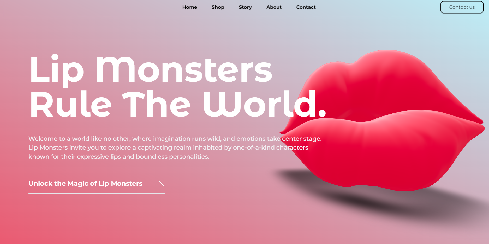
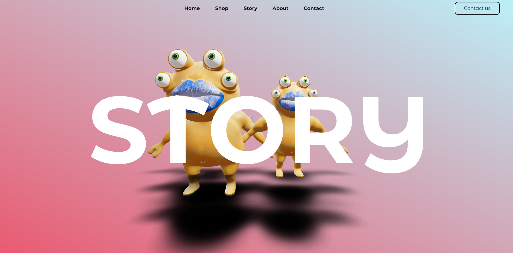
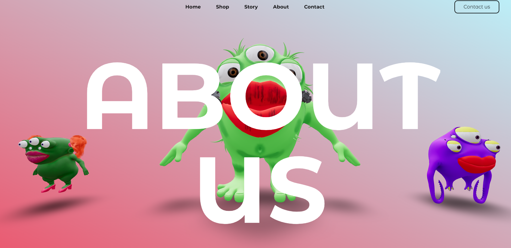
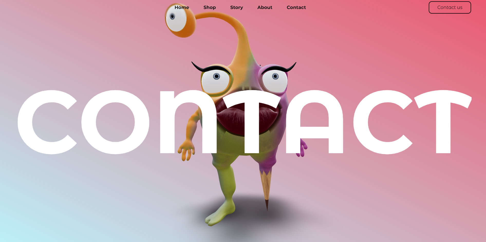

# Lip-Monsters 
A Children's Book Presentation and Sales Website 

## Project Overview 

"Lip Monsters" is a captivating web project designed for presenting and selling a delightful children's book. It features various pages, including a main page, sections about the book's history, its characters, the creator, contact information, and a page with a brief description of the book and purchase options. 

## Technologies Used 

- **React:** The project's dynamic interface is built with React. 
- **Vite:** Vite is used for efficient development and building. 
- **Three.js:** We have harnessed the power of Three.js to create mesmerizing 3D animations and objects. 
- **Blender:** All 3D objects and animations are crafted using Blender. 
- **Framer Motion:** Framer Motion adds smooth animations and transitions to enhance user experience. 
- **GSAP (GreenSock Animation Platform):** GSAP is used for advanced animations and visual effects. 

## Features 

- **Main Page:** The landing page introduces visitors to the enchanting world of "Lip Monsters." 

- **Book's History:** Learn about the journey of creating the book and the charming characters that inhabit it. 

- **About the Creator:** Discover the talented individuals behind the book, including the writer, illustrator, and creator. 

- **Contact Information:** Find a convenient way to get in touch with us, should you have any questions or feedback. 

- **Book Description and Purchase:** A brief overview of the book's plot and easy access to purchase options. 

## Screenshots 
Home Page 

Story Page 

About Us Page 

Contact Page 

##Video 

## Contact 

For inquiries, collaboration opportunities, or feedback, you can reach out to us at [lefebvre.mary90272@gmail.com](mailto:lefebvre.mary90272@gmail.com). 

We appreciate your interest in "Lip Monsters" and look forward to finding a new owner for this captivating children's book presentation and sales website. 

